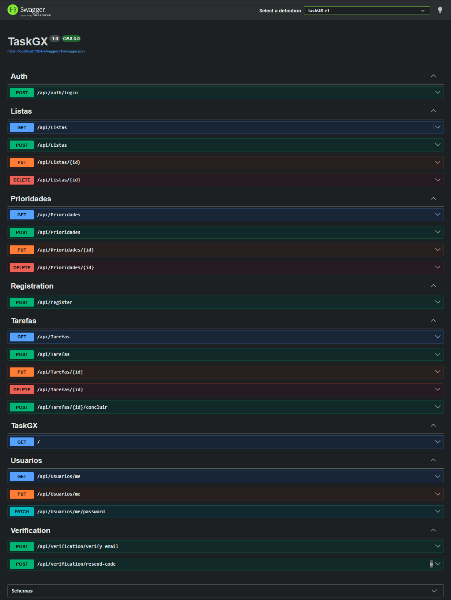
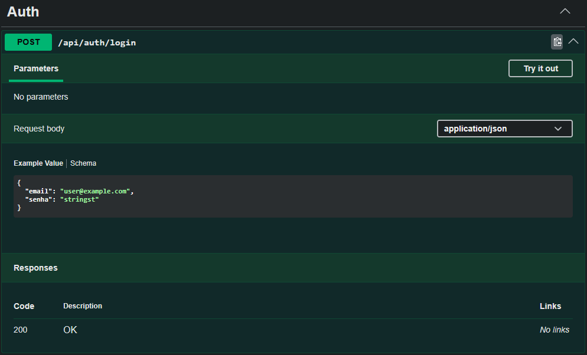
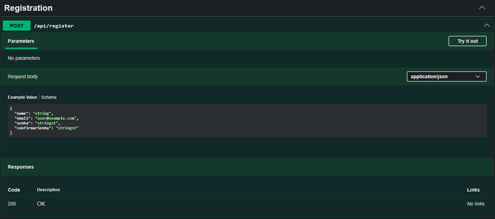
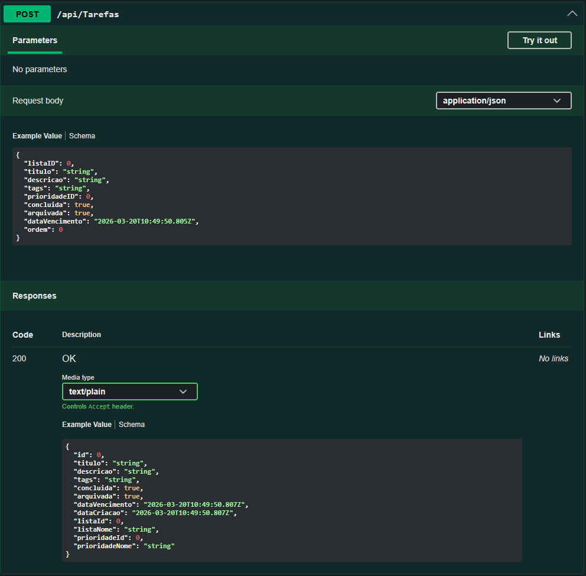

# TaskGX-API

TaskGX-API e uma **ASP.NET Core Web API** criada para suportar o ecossistema TaskGX, disponibilizando funcionalidades de **autenticacao**, **gestao de utilizadores**, **tarefas**, **listas**, **prioridades** e **verificacao de email**.

O projeto foi desenvolvido para consolidar competencias de backend e manter uma API organizada, pronta para suportar aplicacoes web e desktop.

---

## Tecnologias

- **C#**
- **ASP.NET Core Web API**
- **MySQL**
- **JWT**
- **REST API**
- **Swagger / OpenAPI**

---

## Funcionalidades Principais

- Cadastro de utilizadores
- Login com autenticacao JWT
- Fluxo de verificacao de email
- Criacao e gestao de tarefas
- Organizacao de listas
- Gestao de prioridades
- Endpoints de perfil do utilizador
- Arquitetura em camadas com responsabilidades separadas

---

## Estrutura do Projeto

- **Controllers**: expõem os endpoints HTTP
- **Services**: concentram a logica de negocio
- **Repositories**: tratam o acesso aos dados
- **Models**: representam as entidades do dominio
- **DTOs**: definem contratos de request e response
- **Data**: contem a configuracao do contexto de base de dados

---

## Previsualizacao da API

### Visao Geral do Swagger

### Endpoint de Login

### Endpoint de Cadastro

### Endpoint de Criacao de Tarefa

---

## Areas Cobertas

- **Autenticacao**
- **Cadastro**
- **Verificacao de Email**
- **Usuarios**
- **Tarefas**
- **Listas**
- **Prioridades**

---

## Objetivo

Este projeto faz parte do meu percurso de aprendizagem em desenvolvimento de software, com foco em:

- Arquitetura backend
- Desenvolvimento de APIs com ASP.NET
- Autenticacao e autorizacao
- Aplicacoes orientadas a base de dados
- Organizacao e manutencao de codigo

---

## Melhorias Futuras

- Adicionar documentacao completa dos endpoints
- Melhorar validacoes e tratamento de erros
- Adicionar testes unitarios e de integracao
- Evoluir a configuracao de deploy
- Expandir a documentacao da API com exemplos de uso

---

## Autor

**Lucas Castro Silva**  
Estudante de Gestao e Programacao de Sistemas de Informacao
